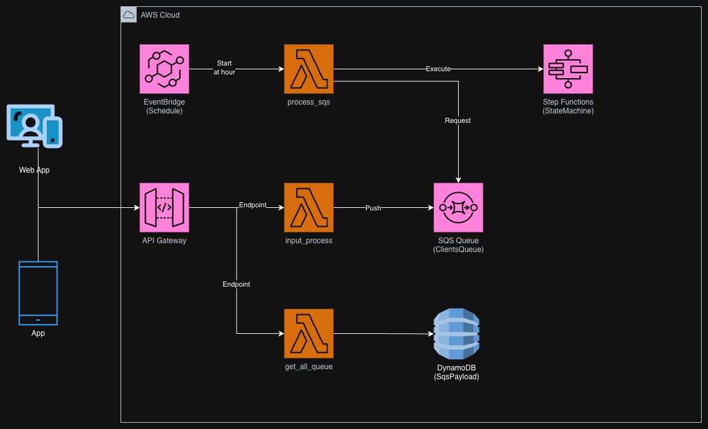

# Serverless ETL & Orchestration Process

A robust asynchronous processing engine built with the **Serverless Framework**. This project implements an ETL-like workflow that handles incoming data via API, decouples processing through **AWS SQS**, and orchestrates complex business logic using **AWS Step Functions**.

## 🚀 Architectural Highlights

- **Event-Driven Design:** Uses **AWS EventBridge** to trigger workflows based on system events.
- **State Machine Orchestration:** Manages a multi-step process (Create Person -> Upload PDF -> Send Email) with built-in error handling and retries via **AWS Step Functions**.
- **Asynchronous Scalability:** Implements **AWS SQS** to buffer incoming requests, allowing the system to handle spikes in traffic without failing.
- **Persistent Tracking:** Saves every transaction state in **DynamoDB** to ensure data consistency and allow for auditing of unprocessed items.

## 🛠️ Tech Stack

- **Language:** Python 3.7
- **Orchestration:** AWS Step Functions
- **Messaging:** AWS SQS & EventBridge
- **Storage:** AWS DynamoDB & S3
- **Framework:** Serverless Framework v3.29.0
- **Testing:** Pytest with Coverage

## 📂 Project Structure

- `functions/`: 
    - `input_process.py`: Entry point that validates data and pushes to SQS.
    - `proecess_sqs.py`: Worker that consumes messages and starts the State Machine.
    - `step_function/`: Individual task handlers for the orchestration logic.
- `.cloudformation/`: Modular Infrastructure as Code (IaC) for DynamoDB tables, IAM roles, and SQS queues.
- `utils/`: Shared logic for AWS resource interaction (DynamoDB/SQS) and data validation.
- `lib/`: Standardized API response handlers.

## 🏗️ Architecture Diagram



## ⚙️ Setup and Deployment

### Prerequisites
- Node.js and Serverless Framework.
- Python 3.7.
- AWS CLI configured with appropriate permissions.

### Installation
1. Install Node.js dependencies:
   ```bash
   npm install

2. Install Python dependencies:
   ```bash
   pip install -r requirements.txt

3. Environment Configuration:
   ```yaml
    TABLA_SQS_PAYLOAD: "DynamoDB table name for payloads."
    ARN_STATE: "ARN of the Step Function state machine."
    URL_QUEUE: "AWS SQS URL"
    # ... other variables

4. Deployment:
   ```bash
   sls deploy -s dev

5. Testing:
   ```bash
   pytest test/test.py --cov=utils --cov-report=term-missing

Developed by benjoks.